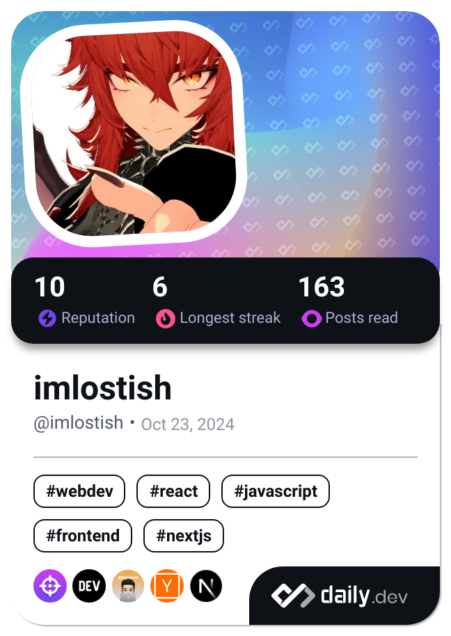

<h1 align="center">Hi, I'm Losti 👾</h1>
<h3 align="center">Full-Stack Developer in Progress · Software Engineering Enthusiast · Arch Linux Fan</h3>

## 👨‍💻 About Me

I’m a passionate developer with a strong curiosity for how things work — from high-level frontend frameworks to low-level systems programming. My journey is guided by learning, building, and helping others through technology.

- 🎯 Currently studying at [cibertec](https://www.cibertec.edu.pe), aiming to earn my diploma while pursuing real-world skills beyond the classroom.
- 🧠 Self-taught in Full-Stack Development and expanding into system-level programming (Rust, C, Go).
- 🛠 I love building tools, automating workflows, and understanding full systems.
- 🤝 Open to collaborations, open source contributions, and cool project ideas.

> “If it doesn’t exist yet, I’ll try until it does.”

## 🚀 Current Focus

- 🌐 Mastering TypeScript + React + Next.js
- 🧩 Designing APIs with Node.js, Go, and Rust
- 🐳 Learning Docker, Redis, and self-hosting workflows
- 🐧 Expanding my Linux & CLI superpowers
- 🧠 Reading & self-improvement, including communication and productivity

## 🛠 Tech Stack

### 💻 Languages & Frameworks

### 🗄 Databases & Infra

### 🛠 Tools

## 📚 I’m Learning

- 🧠 Clean architecture, system design, testing and documentation
- 💾 Database design (PostgreSQL, SurrealDB, Redis)
- 🌐 DevOps basics (CI/CD, Docker, VPS self-hosting)
- 🧱 Rust & Go for backend APIs
- ✨ Design systems and developer tooling

## 🧩 Fun Projects Coming Soon

- **[imlosti.sh](https://imlosti.sh)** content, services, and community tools — built with Next.js, Docker, and more.
- **Woka** — a self-hostable platform for business management and digital presence.

## 💬 Let's Connect

- 📬 X: [@imlostish](https://x.com/imlostish)
- 📺 YouTube: [@imlostishdev](https://youtube.com/@@imlostishdev)
- ☕ Ko-fi: [Support me](https://ko-fi.com/lostish)

## ❤️ Creators & Projects I Support

I love supporting other creators who inspire me with their creativity and tech passion. Check them out:

- [Dyarikku](https://x.com/dyarikku)
- [Zentreya](https://x.com/zentreya)
- [Mohit Mishra (chessMan786)](https://x.com/chessMan786)
- [Aiden Bai](https://x.com/aidenybai)
- [Jarred Summer](https://x.com/jarredsumner)
- [Guillermo Rauch (rauchg)](https://x.com/rauchg)

## 📊 Github Stats

 

## Roadmap.sh Stats

## Daily.dev Stats

